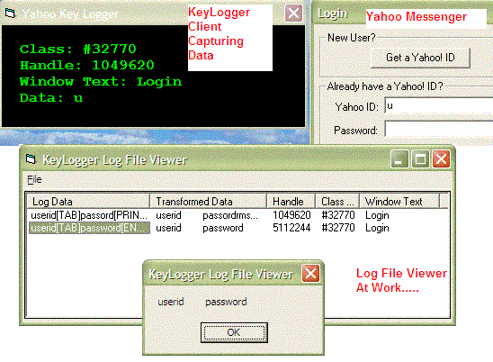



## Key Logger Engine

### Description

UPDATED ON 18th Feb. 2004 WITH NEW YAHOO KEY LOGGER AS CLIENT. KeyLogger is a DLL engine for logging keys typed by a computer user.The features that make this unique is that it can capture special keys like Windows Menu Key , Context Menu Key,Print Screen and also tell you the status of toggle keys like Caps Lock,Num Lock , Scroll Lock And Insert Key. The most important part of it is that you can even capture the keystrokes of a specific application by providing its Class Name of its Window Caption.It Store All The Keys Into A File In Encrypted Form So This Submission also include a Log Viewer Which decrypt them and make them readable and show it in a ListView Control. A Yahoo Key Logger Client Sample is also included which can log all the keys pressed during the yahoo messenger's Login Dialog box is visible and active. All In All This is a great tool but still contains some bugs as this is very first version. please inform me any bugs and errors and also dont forget to rate my code but most important is ur comments. TRY THIS ATLEAST ONCE BY URSELF.
 
### More Info
 

             |
---                |---
**Submitted On**   |2004-02-17 23:51:56
**By**             |[V2](https://github.com/Planet-Source-Code/PSCIndex/blob/master/ByAuthor/v2.md)
**Level**          |Intermediate
**User Rating**    |5.0 (10 globes from 2 users)
**Compatibility**  |VB 5\.0, VB 6\.0
**Category**       |[Miscellaneous](https://github.com/Planet-Source-Code/PSCIndex/blob/master/ByCategory/miscellaneous__1-1.md)
**World**          |[Visual Basic](https://github.com/Planet-Source-Code/PSCIndex/blob/master/ByWorld/visual-basic.md)
**Archive File**   |[Key\_Logger1710362182004\.zip](https://github.com/Planet-Source-Code/v2-key-logger-engine__1-51793/archive/master.zip)

